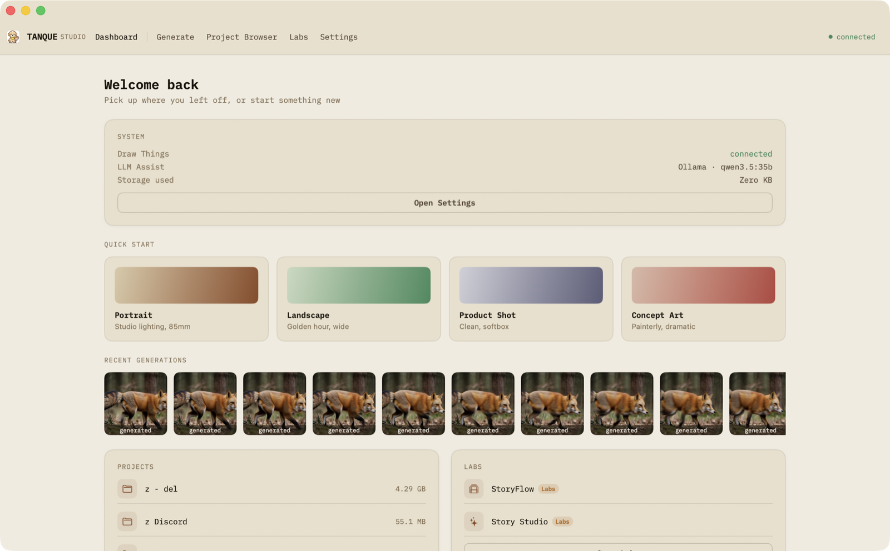
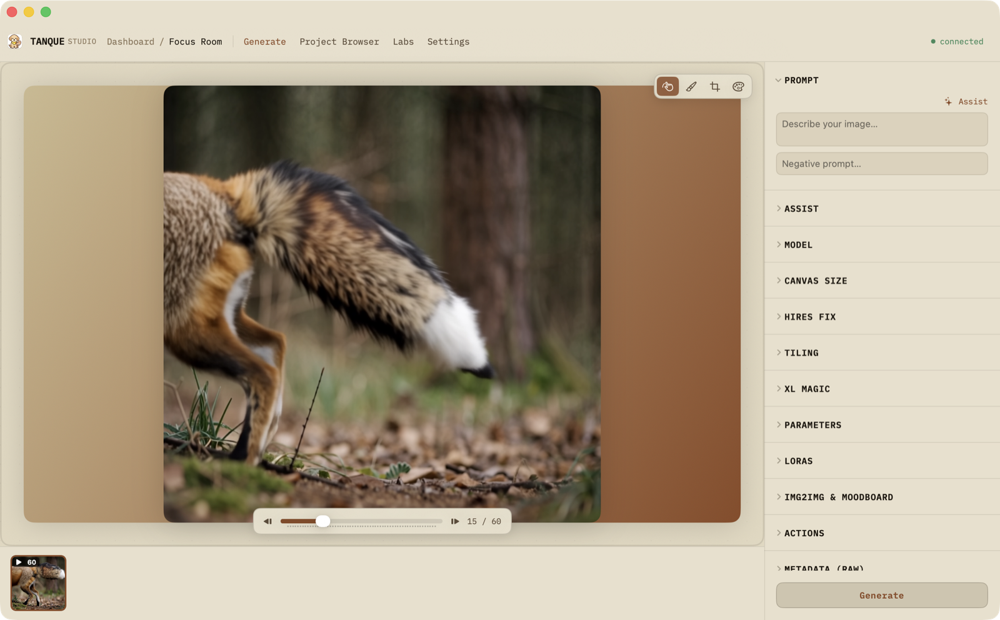
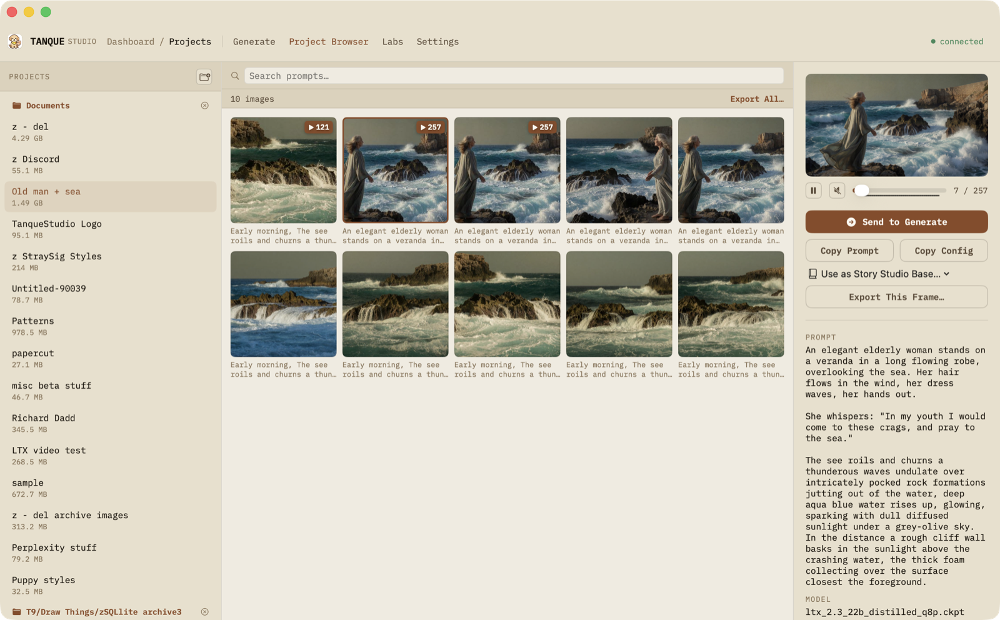
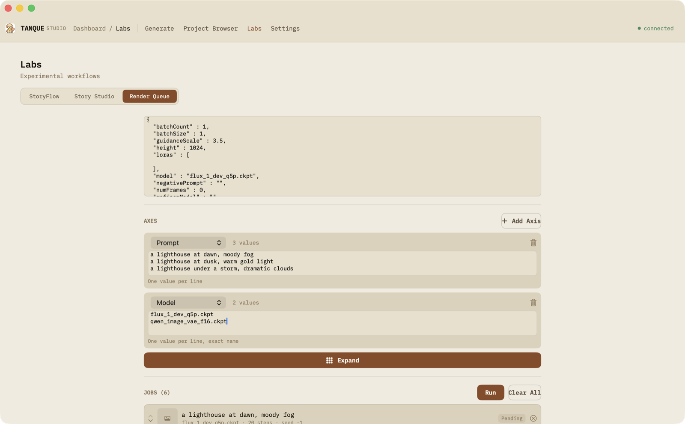

# Tanque Studio

A native macOS companion app for [Draw Things](https://drawthings.ai), providing a focused AI image generation workspace, Draw Things project browsing, StoryFlow/Story Studio authoring, batch render queues, and LLM-assisted prompt enhancement.

## Screenshots

| Dashboard | Focus Room |
|---|---|
|  |  |

| DT Project Browser | Render Queue |
|---|---|
|  |  |

## Features

### Dashboard + Focus Rooms

The app opens on a **Dashboard** home screen rather than dropping straight into the generation workspace:

- **Continue card** — resume the last in-progress session with one click
- **System card** — live Draw Things connection, LLM Assist status, storage used
- **Quick Start** — preset prompts/models that jump straight into a fresh session
- **Recent Generations** strip and **Projects** / **Labs** mini-lists
- A persistent top nav (**Project Browser** · **Labs** · **Settings**) reachable from every screen, not just from the Dashboard

Opening a session (or clicking any image) enters a **Focus Room**: a full-bleed canvas + filmstrip below it, with all generation controls tucked into a single collapsible drawer on the right (Prompt, Assist, Model, Parameters, LoRAs, img2img & Moodboard, Actions) instead of stacked side panels. The feature set is the same one detailed below — same `GenerateViewModel`, same gRPC transport — just delivered through the drawer instead of dedicated left/right panels.

---

### Generate

The generation feature set — prompt/config, canvas, gallery, LLM Assist, actions — described panel-by-panel below. In the running app this now lives inside a Focus Room's accordion drawer (see above) rather than a dedicated four-panel screen, but every capability listed here still applies.

**Left panel**

- Prompt and negative prompt fields
- Model picker with full filename display
- Config import — load presets from Draw Things `custom_configs.json`
- Canvas size presets (S / M / L) that preserve the current aspect ratio
- Aspect ratio tiles (1:1, 4:3, 3:4, 16:9, 9:16, 3:2, 2:3, 21:9, 1:2, 2:1)
- Full parameter set: sampler, steps, CFG, shift, seed, seed mode, stochastic sampling gamma, batch count, strength, refiner model and start
- LoRA list with per-LoRA weight sliders and +/− buttons; add LoRAs from the picker
- img2img source image drop zone
- Moodboard strip: reference images with per-image weight sliders (0–1); drag from Finder

**Canvas**

- Pinch to zoom (0.5×–6.0×), drag to pan, double-tap to reset
- Zoom percentage indicator
- Drag-and-drop PNG onto canvas to inspect metadata

**Right panel — Metadata tab**

- Generation parameters, model, LoRAs, dimensions, seed

**Right panel — Assist tab**

LLM operations system. Operations are Markdown files with YAML frontmatter stored in `~/Library/Application Support/TanqueStudio/LLMOperations/`. Built-in operations are bundled with the app; users can add custom operations by dropping `.md` files into that folder.

- Operations selector
- Prompt input seeded from the currently selected gallery image's metadata
- Result preview with Apply / Discard
- Supports Ollama, LM Studio, and Jan

**Right panel — Actions tab**

- **Send All** — apply prompt, negative, and full config to the left panel
- **Send Prompt** — apply prompt and negative prompt only
- **Send Config** — apply model, sampler, steps, CFG, seed, dimensions, LoRAs
- **Send to img2img** — set current image as img2img source (uses visible crop when zoomed)
- **Add to Moodboard** — add current image to the moodboard strip

**Gallery strip**

- Saved images shown newest-first
- Color-coded border (green = generated, gray = imported)
- Tap to load image and metadata
- Context menu: Reveal in Finder, Copy, Delete
- Keyboard navigation in immersive mode (arrow keys, Escape)

---

### Moodboard

Add reference images to influence generation via gRPC shuffle hints.

- Drag image files from Finder directly into the moodboard strip
- Per-image weight sliders (0.0–1.0)
- Remove individual images or clear all
- Works with models that support reference/shuffle hints (Qwen Image Edit, Flux, etc.)

---

### DT Project Browser

Browse Draw Things project databases directly from the app.

- Add folders containing `.sqlite3` project files (local, external drives, network volumes)
- Security-scoped bookmarks for persistent folder access across launches
- Thumbnail grid with prompt preview, date, and dimensions
- Search and pagination (50 entries per page)
- **Send to Generate** — applies full config: prompt, negative, model, dimensions, steps, CFG, seed, sampler, seed mode, strength, shift, LoRAs; sets thumbnail as img2img source

---

### StoryFlow (Labs)

A visual workflow editor for authoring Draw Things automation without hand-writing JSON.

- Step types: accumulators (config, prompt, `concat`, `wildcard`, `sweep`), canvas ops (`size`, `adaptSize`, clear canvas), flow control (`Loop`/`EndLoop`), a human-in-the-loop `approve` step, and passthrough support for the rest of Draw Things' 34-entry instruction set
- Most instructions run natively in-app — `sweep`, `wildcard`, `concat`, and inpaint tools execute without leaving Tanque Studio; the remainder export as Draw Things' own pipeline script format
- Round-trips with Draw Things' own Editor: import an Editor-authored project, or export a Tanque Studio-authored one and paste it directly into a Draw Things StoryFlow script
- Reusable config/prompt/image/LoRA/wildcard variables shared across steps

### Story Studio (Labs)

Chapter-and-scene project structure for multi-render stories with assembled prompts.

- Projects hold characters, settings, chapters, and scenes; each scene's prompt assembles live from its character/setting fragments plus its own description
- Compiles to a StoryFlow workflow per scene or per chapter, with variant approval on each render
- Per-field LLM enhance, plus a one-shot narrative writer for scene text
- Chapter contact-sheet export — image sequence, storyboard, or comic grid, as PNG or PDF
- Base Config is a saved Draw Things config (or a sensible built-in default) that's easy to change: "Use a saved config…" in Project Info, and a Settings toggle for what new projects start from

### Render Queue (Labs)

Batch rendering across a matrix of prompts, models, LoRAs, and settings — the thing Draw Things can otherwise only do by hand-scripting.

- Define axes (prompt, negative prompt, model, sampler, seed mode, LoRA sets, steps, seed, guidance scale, strength, shift) over a base prompt/config
- Expand into a flat, editable list of concrete standalone jobs — prune, reorder, or leave any of them before running
- Run, pause between jobs, and resume; a job that fails (unknown model, a server hiccup) never aborts the ones after it
- Every job's config and prompt are captured as a full standalone snapshot, so a row stays reproducible even after the axes that produced it change

---

### Settings

- **Draw Things connection** — host, port, shared secret, history dropdown, test connection (gRPC)
- **LLM provider** — Ollama / LM Studio / Jan; host with history dropdown, model, max tokens, test connection
- **Save folder** — default save location (security-scoped bookmark)
- **Appearance** — panel width defaults

---

## Requirements

- macOS 14.0 or later
- [Draw Things](https://apps.apple.com/app/draw-things-ai-generation/id6444050820) with API Server enabled
- Optional: [Ollama](https://ollama.ai), [LM Studio](https://lmstudio.ai), or [Jan](https://jan.ai) for Assist tab features

---

## Getting Started

1. **Install Draw Things** from the Mac App Store
2. **Enable the API Server** in Draw Things: Settings → API Server → Enable
3. **Launch Tanque Studio** — opens on the Dashboard
4. **Configure connection** via **Settings** in the top nav → Draw Things Connection  
   Default: `localhost:7859` (gRPC)
5. **Test Connection** to verify connectivity
6. Pick a **Quick Start** preset (or the **Continue** card to resume a prior session) to enter a Focus Room, type a prompt, and click **Generate**

### For Assist tab features (optional)

1. Install Ollama, LM Studio, or Jan
2. Configure the LLM provider in **Settings** → LLM Provider
3. Test the connection
4. In a Focus Room, click the **✨ Assist** button next to the prompt field — it expands the Assist section in the drawer and runs the default operation automatically

### For DT Project Browsing

1. Click **Project Browser** in the persistent top nav (reachable from any screen)
2. Click **Add Folder** and select a folder containing `.sqlite3` project files
   - Default Draw Things location: `~/Library/Containers/com.liuliu.draw-things/Data/Documents/`
   - External drives: navigate to any mounted volume under `/Volumes/`
3. Select a project database to browse with thumbnails and metadata

---

## Bundled Config Presets

`DrawThingsStudio/Resources/community_models_configs.json` contains all 49 of Draw Things' built-in model configurations, pulled from the official [drawthingsai/community-models](https://github.com/drawthingsai/community-models/tree/main/configs) repo and merged into the `custom_configs.json` array format. These ship inside the app bundle and appear automatically in the config picker under **Built-in**, alongside any configs you import yourself.

Source retrieved 2026-06-12. Note: each preset references a specific model file (e.g. `flux_1_dev_q5p.ckpt`) and applies fully only if that model is downloaded in Draw Things.

---

## Architecture

```
DrawThingsStudio/
├── App & Navigation
│   ├── TanqueStudioApp.swift          # App entry, ModelContainer, migrations — WindowGroup root is DashboardRootView
│   ├── ContentView.swift              # Classic NavigationSplitView shell, sidebar (no longer the app root; kept for reference)
│   └── AppSettings.swift              # @Observable settings singleton (UserDefaults)
│
├── Dashboard (default navigation as of v0.9.25)
│   ├── DashboardRootView.swift        # WindowGroup root: mode switch (dashboard/focus/projects/labs/settings)
│   ├── DashboardTopBar.swift          # Wordmark, breadcrumb, persistent Project Browser/Labs/Settings nav
│   ├── DashboardHomeView.swift        # Continue/System/Quick Start/Recent Generations/Projects+Labs cards
│   ├── FocusRoomView.swift            # Full-bleed canvas + filmstrip; Paint/Crop/Color-Draw edit modes, scrubber
│   ├── DashboardFocusPanels.swift     # Focus Room's accordion drawer (Prompt/Assist/Model/Parameters/LoRAs/img2img/Actions)
│   ├── DashboardLabsPage.swift        # Labs pill-tabs (StoryFlow / Story Studio / Render Queue)
│   └── DashboardDS.swift              # Isolated light "paper" design tokens for this navigation
│
├── Generate (business logic + classic four-panel view, reused by both navigations)
│   ├── GenerateView.swift             # Classic four-panel root layout (config left, canvas center, gallery, inspect right)
│   ├── GenerateLeftPanel.swift        # Config: prompt, params, LoRAs, moodboard
│   ├── GenerateRightPanel.swift       # Metadata / Assist / Actions tabs
│   ├── GalleryStripView.swift         # Resizable gallery column
│   ├── GenerateViewModel.swift        # @MainActor @Observable ViewModel — shared by Dashboard and the classic view
│   └── ImageStorageManager.swift      # Writes PNG + thumbnail, creates TSImage
│
├── DT Project Browser
│   ├── DTProjectDatabase.swift        # SQLite + FlatBuffer reader
│   ├── DTProjectBrowserView.swift     # 3-column HSplitView browser
│   └── DTProjectBrowserViewModel.swift
│
├── StoryFlow (Labs)
│   ├── StoryFlowEngine.swift          # Accumulator engine: config + prompt, Loop/EndLoop, canvas ops
│   ├── StoryFlowModels.swift          # Variables, steps, workflows
│   ├── StoryFlowStorage.swift         # JSON-per-file storage, output folders, canvas PNG I/O
│   ├── StoryFlowProjectCodec.swift    # Lossless project export/import + DT pipeline export
│   └── StoryFlowView/ViewModel/*Panel.swift
│
├── Story Studio (Labs)
│   ├── StoryStudioModels.swift        # SwiftData schema v2: project/character/setting/chapter/scene
│   ├── StoryStudioView.swift          # Library ↔ workspace shell, outline column
│   ├── StoryStudioEditors.swift       # Project Info / chapter / character / setting editors
│   ├── StorySceneEditor.swift         # Scene editor + LLM-assist bar
│   └── StoryStudioRenderController.swift  # Compiles a scene/chapter to StoryFlow, runs it, routes results
│
├── Render Queue (Labs)
│   ├── RenderQueueModels.swift        # SwiftData axis/job models + UserDefaults-backed base settings
│   ├── RenderQueueExpander.swift      # Pure matrix → job-list expansion (axes × base config/prompt)
│   ├── RenderQueueController.swift    # Runs pending jobs, one direct render call per job
│   └── RenderQueueView.swift          # Base config, axis editor, job list (prune/reorder/pause/run)
│
├── Settings
│   └── SettingsView.swift
│
├── Support
│   ├── TanqueDS.swift                 # Tanque Design System tokens
│   ├── ImageFolderAccess.swift        # Security-scoped reads for custom folders
│   ├── LLMService.swift               # Ollama / LM Studio / Jan client
│   ├── LLMOperationLoader.swift       # File-based LLM operations
│   └── DTConfigImporter.swift         # Draw Things custom_configs.json import
│
├── Data & Persistence
│   └── DataModels.swift               # TSImage SwiftData model, ImageSource
│
└── Draw Things Integration (ported, do not modify)
    ├── DrawThingsProvider.swift        # Protocol + DrawThingsGenerationConfig
    ├── DrawThingsGRPCClient.swift      # gRPC transport (port 7859)
    ├── DrawThingsAssetManager.swift    # Local model/LoRA management
    ├── CloudModelCatalog.swift         # ~400 models from Draw Things GitHub
    ├── PNGMetadataParser.swift         # DTS, DT native, A1111, ComfyUI metadata
    └── RequestLogger.swift             # Debug request log
```

**SwiftData schema** — the core gallery model plus one schema group per Labs feature (`TanqueStudioApp.swift`, additive-only version bumps, no destructive wipe since v1):

```swift
@Model final class TSImage {
    var id: UUID
    var filePath: String
    var createdAt: Date
    var source: ImageSource       // .generated | .imported | .dtProject
    var configJSON: String?
    var collection: String?
    var batchID: UUID?
    var batchIndex: Int?
    var thumbnailData: Data?
}
```

Story Studio adds `StoryProject` / `StoryCharacter` / `StorySetting` / `StoryChapter` / `StoryScene` / `SceneCharacterPresence`; the Render Queue adds `RenderQueueAxis` / `RenderQueueJob`.

---

## Roadmap

### Completed

- [x] **README screenshots** — Dashboard, Focus Room, DT Project Browser, and Render Queue, captured against a real project and a real video series so the shots show grouped clips and a populated job list rather than empty states. Unblocked by granting Screen Recording permission to Claude, the app hosting this project's coding sessions — the demo GIF is the one piece still open, see Backlog
- [x] **StoryFlow 260723 Phase 3 — native execution** — `concat`, `wildcard` and `sweep` (stateful loop/once/shuffle/random trackers), `size`, `frames`, `negPrompt`, `adaptSize`, `moodboardWeights`, `moodboardRemove`, `inpaintTools`, `framesDialog`, and a human-in-the-loop `approve` sheet all run in-app with no DT script. Adopts the `concat` accumulator semantics, which retires the export re-emit hack
- [x] **StoryFlow 260723 Phase 2** — the 34-entry instruction schema table, a generic step card that renders any entry, and the exit criterion: a Tanque Studio-authored project run in Draw Things' own pipeline
- [x] **DT Project Browser — video clips** — frames collapse into one cell per clip, hover to play, scrub and hear audio in the detail panel, export cover frame / all frames / `.mp4` **with the clip's soundtrack muxed in as AAC**, Delete Series
- [x] Generate workspace — four-panel layout, canvas zoom/pan, gallery strip
- [x] Full generation config — all Draw Things parameters, LoRAs, img2img, batch
- [x] Config presets — import from Draw Things `custom_configs.json`
- [x] Canvas size presets and aspect ratio tiles — dimensions land on Draw Things' 64px grid via a four-corner search (`CanvasSizing`) that keeps the closest ratio rather than rounding each axis on its own, and a chip reads as active when it is the canvas that chip produces
- [x] Moodboard — gRPC reference/shuffle hints with per-image weights
- [x] Assist tab — LLM operations with file-based operation definitions
- [x] Actions tab — round-trip send to generate, crop-to-zoom img2img
- [x] DT Project Browser — SQLite + FlatBuffer, pagination, Send to Generate
- [x] gRPC transport with streaming progress
- [x] Host connection history dropdowns
- [x] StoryFlow v2 — accumulator workflow engine, Loop/EndLoop, canvas ops, project codec, DT pipeline export
- [x] PNG metadata embedding — EXIF UserComment (DT-compatible) + IPTC, resolved seeds (never -1)
- [x] Custom save folder — security-scoped bookmarks, restart-safe gallery reads
- [x] Shared secret support for protected Draw Things servers
- [x] Batch seed parity — xorshift32 per-image seed derivation matching Draw Things exactly
- [x] DT metadata protocol parity — integer sampler/seedMode enums in v2 metadata
- [x] Seed randomization — dice button + randomize-each-run toggle, -1 sentinel eliminated from UI
- [x] Built-in presets — 49 bundled Draw Things community-models configs
- [x] Resolution Dependent Shift — Generate toggle with auto-computed shift for rectified-flow models (v0.9.17)
- [x] Connection & inventory UX — secret normalization + reveal toggle, model-list refresh, connection-cause banner, unknown-model handling, search-first model picker (v0.9.19)
- [x] Canvas editing — View / Paint / Crop modes on the Generate canvas: inpainting (paint mask → regenerate region via gRPC), crop-to-img2img, stroke undo/redo (v0.9.20)
- [x] LLM Operations on a remote/custom volume — configurable operations folder with a security-scoped bookmark (v0.9.21)
- [x] StoryFlow pipeline fixes, pane-switch state persistence, DT+ bridge compatibility (v0.9.21)
- [x] Color draw canvas mode — paint colored strokes on an image or blank canvas, flatten to img2img source for edit models (Qwen Image Edit, FLUX.1 Fill) or save to gallery
- [x] Canvas-edit lifecycle fixes — mid-render gallery navigation no longer overwrites the selection; fully-erased masks can't trigger a no-op inpaint
- [x] Zoom while painting — pinch zoom + ⌥-drag pan in paint/crop/color-draw modes, screen-constant brush, shared zoom state with view mode
- [x] Left panel tightening — collapsible sections with persisted state, basic/advanced config split
- [x] Shared secret on Echo — model/LoRA inventory loads on protected servers (upstream PRs [#16](https://github.com/euphoriacyberware-ai/DT-gRPC-Swift-Client/pull/16)/[#17](https://github.com/euphoriacyberware-ai/DT-gRPC-Swift-Client/pull/17) merged 2026-07-03, adopted + verified live)
- [x] Story Studio Phase 1 — data models (SwiftData schema v2), project library with create/rename/duplicate/delete (spec: `Docs/story-studio-v2-spec.md`)
- [x] DT Project Browser bulk export — ⌘-click multi-select, Export Selected / Export All, stored full-size JPEGs written byte-for-byte
- [x] Leaving paint mode cancels an in-flight inpaint (closes the last v0.9.20 known-minor)
- [x] Story Studio — project/character/setting/chapter/scene management, live prompt assembly, compile-to-StoryFlow render pipeline with variant approval (Phases 1–3; Phase 4 extras still upcoming)
- [x] Video generations — DT frame series captured as one grouped gallery item (previously all frames past the first were discarded), frame scrubber, export frames / assemble .mp4, frame count unclamped beyond DT client defaults
- [x] Learnability Phase 1 — first-run welcome flow, markdown-driven in-app Help (10 topics), empty-state coaching, tooltip audit
- [x] Connection reliability — bounded timeout on gRPC asset fetches, a refresh button that always works, Test Connection that checks the real secret, an honest connected/disconnected signal instead of a cosmetic one
- [x] Story Studio Phase 4 — Send to Generate from a rendered variant, chapter contact-sheet export (image sequence/storyboard/comic grid, PNG+PDF), per-field LLM enhance + one-shot narrative writer on scene text
- [x] Learnability Phase 2 — TipKit tips for hidden gestures (⌥-drag pan, ⌘-click multi-select, paste-config, dice/randomize, RDS); Story Studio help topic rewritten as a numbered walkthrough
- [x] StoryFlow 260723 Phase 1 — Editor-saved projects load again. Values written as JSON numbers (`frames`, `frames8`, `moodboardRemove`) used to throw and take the whole project with them, so no Editor-saved video project had ever opened. Loop count/start are no longer silently discarded, and object-valued instructions export as real JSON rather than quoted strings. The pipeline export now matches the format author's own export byte-for-byte on a reference project — 20 of 20 instructions, zero differences — guarded by a checked-in fixture and harness (spec: `Docs/storyflow-260723-spec.md`)
- [x] Run warnings — before a StoryFlow run, Tanque Studio says what it will skip and whether that changes the render, and flags the case where a project has no Generate step and so produces nothing at all
- [x] StoryFlow test hardening — the round-trip checks (including the diff against the format author's own reference export) moved out of a hand-run script and into the test suite, plus a third real project as a fixture
- [x] Config parity Batch D — tiling: Tiled Diffusion and Tiled Decoding, each with tile size and overlap, in a new Tiling section. Sizes are entered in pixels the way Draw Things itself reports them, and converted at the wire boundary — the opposite convention from Hires Fix, where the client does that conversion. Defaults match what was already being applied invisibly, so turning the section on changes nothing until you do
- [x] Draw Things client bump (`c8f8493`) — unblocks config-parity Batch D. Note that seedMode 2/3 encoding changes output for the same seed, and the default seed mode is Scale Alike
- [x] StoryFlow design pass — StoryFlow moved onto the Dashboard's paper palette, with seventeen per-step-type colours replaced by six semantic accent families (accumulator / render / canvas / clear / flow / inert) and a shared step-card chrome, so Phase 2's step cards are authored once rather than built and then restyled
- [x] Imported StoryFlow projects actually render — Draw Things' `prompt` instruction both sets the text and renders, while Tanque Studio splits those into two steps, so every Editor-authored project used to walk all its steps and report "Run complete" over an empty gallery. Import now synthesises the render step, and export drops it again, so the pipeline output is byte-for-byte unchanged
- [x] Video series in the DT Project Browser — a clip collapses into a single cell badged with its frame count instead of flooding the grid with N loose frames (one real project goes from 1,437 rows to 157 cells), with Delete Series as one action. Draw Things exposes a real series key (`clip_id` + `index_in_a_clip`, plus a `Clip` table carrying count and fps), so the grouping is exact rather than heuristic, and it happens before pagination so a clip is never split across a page boundary
- [x] StoryFlow 260723 Phase 2 — author the new instructions. A declarative schema table (34 instructions, transcribed from the format author's editor rather than invented) plus one generic step card that renders any entry from it, so `concat`, `wildcard`, `sweep`, `size`, `negPrompt`, `approve`, `framesDialog` and the long passthrough backlog are all authorable from the add-step menu. Export-only — these run inside Draw Things. **Verified the way that actually counts**: a workflow authored from scratch in Tanque Studio was exported, pasted into Draw Things' own StoryFlow pipeline script, and run. Preflight passed and three images rendered, with the prompts, guidance sweep, seed and dimensions read back out of Draw Things' database to confirm `concat` assembled around the wildcard with exact spacing and `sweep` reached a real config field as real numbers. `interrogate` is deliberately excluded and stays passthrough-only
- [x] Clips play in the DT Project Browser — hover a video render and it plays in place at the frame rate Draw Things recorded; click it and the detail panel gives play/pause and a frame scrubber. Playback decodes the clip's frames once and draws one per display tick rather than assembling a movie, and the frame shown is derived from elapsed time, so a dropped tick costs one frame instead of putting playback behind the clock. Export asks what you want: the cover frame, every frame as numbered JPEGs, or an assembled .mp4 at the clip's own frame rate
- [x] DT Project Browser on the Dashboard palette — the last screen still asking for a dark colour scheme inside the Dashboard's light shell
- [x] StoryFlow canvas resize on `size` / `adaptSize` — both used to set the config and leave the canvas image at its old dimensions, so a following img2img below full strength rendered at the old size. The canvas is now trimmed to the new dimensions as a centred crop, and it only ever trims: growing a canvas in Draw Things reveals empty space, so padding an img2img source with invented pixels would be worse than leaving that axis alone
- [x] Render dimensions floored to a multiple of 64 — Draw Things silently floors width and height, so a 700×500 request came back 640×448 while the config saved beside that image still claimed 700×500. Since a stored config exists to make a render reproducible, one that doesn't describe its own PNG defeats the point. Now applied on every render path — both Generate entry points and StoryFlow. Floor, never round: 700 becomes 640, not the nearer 704
- [x] Settings on the paper palette — the screen painted itself dark inside the app's light shell, so every control the system draws for itself resolved for the wrong scheme and vanished: Shared Secret, API Key, both Test Connection buttons, both Browse buttons. Fixed in both hosts, the Dashboard page and the ⌘, window
- [x] Opening an output folder in Finder — a sandboxed app cannot hand Launch Services a path it holds no live claim on, so the folder buttons failed for image folders outside the container. Writing already worked, which disguised it as a Finder quirk
- [x] A render can't hang forever — a Draw Things server that accepted the connection but never answered left every render path waiting indefinitely with no error: Generate, inpaint and StoryFlow alike. Renders are now bounded by a watchdog whose budget is derived from the request (dimensions, steps, frames, batch) rather than fixed, because a legitimate render takes minutes and a long video render takes hours. Only the cheap calls had been bounded before
- [x] Pasted configs apply in full — a config pasted into a StoryFlow config step applied most of itself and silently dropped the rest, so an XL Magic config gave correct latent scaling with no hires fix and no tiling. Fourteen fields now apply that previously did not, including Draw Things' own metadata shape that writes the hires-fix first pass as a single `1024x768` string
- [x] SDXL size conditioning + XL Magic — SDXL takes six latent size-conditioning values that rescale latent data across overlapping render steps, from composition through to fine detail. They interact, and most of the 887 million combinations distort the image, which is why almost nobody touches them. All six are now modeled end to end (wire, saved metadata, StoryFlow config merges and sweeps), and the drawer gains an **XL Magic** section: a native port of wetcircuit's Draw Things script that constrains all three to one shared eight-entry table, so there are 512 sane combinations chosen with three sliders. StoryFlow's `xlMagic` instruction executes natively as part of the same work. Verified on the wire against a live server — the six values appear in the request log and Draw Things returns an image
- [x] Export All exports what the grid shows — bulk export walks the browser's grouped cells rather than raw database rows, so a five-clip project no longer writes ~1,285 loose frames named by rowid. When the export contains a clip, a sheet asks what a clip becomes (cover image / every frame as JPEG / one `.mp4` per clip with its soundtrack) — the same three choices Export Series offers for one clip, applied to all of them. The sheet, the folder panel and the final summary all count from the same plan the exporter executes, so the promise and the result cannot diverge. Verified end to end on Apple Silicon and on an Intel iMac
- [x] Metadata (raw) in the Focus Room drawer — the current image's metadata record exactly as it arrived, pretty-printed when it's JSON, verbatim otherwise, with Copy. Works for dropped files and gallery renders alike, and shows every key in the file including the ones Generate does not yet apply — the diagnostic half of the lossy-import roadmap item
- [x] Dashboard + Focus Rooms navigation (v0.9.25) — real home screen (Continue card, live system status, Quick Start presets, Recent Generations, Projects/Labs mini-lists) replaces landing straight in Generate; Focus Room's full-bleed canvas + single accordion drawer replaces the four stacked panels for everyday use. Full feature parity with the classic Generate view: LLM Assist, complete Actions (Save/Copy/Send/video export), error/warning surfacing, Paint/Crop/Color-Draw editing, Video Generations batch grouping + frame scrubber. Chosen after a layout-forks spike comparing three navigation concepts.
- [x] Draw Things-compatible PNG metadata, verified against DT's own writer — the short-key JSON now matches DT's schema field-for-field (`ImageConverter.imageData(from:)`), including LoRA entries under DT's own `model` key, DT's exact conditional gating for shift/mask-blur/tiling/refiner/SDXL fields, and a namespaced `tanque` object for the handful of fields DT has no key for. The old `v2` camelCase blob is gone — DT's own reader never consumed it. Fixes a real interop bug along the way: Tanque Studio's "Nvidia GPU Compatible" seed mode is now respelled to DT's exact "NVIDIA GPU Compatible" at the write boundary, so the setting survives a round trip through Draw Things instead of silently degrading to Scale Alike
- [x] Generate's metadata applier widened to the full field set — `applyMetadataToConfig` used to restore only 10 of the ~39 fields `DrawThingsGenerationConfig` and `PNGMetadata` both model (model/sampler/steps/guidanceScale/seed/seedMode/width/height/shift/strength); LoRAs, refiner, mask blur, hires fix, tiling, SDXL conditioning, TCD gamma, cfg-zero-star and resolution-dependent shift were parsed and silently discarded. Merging is additive — a field the source doesn't carry leaves the current config untouched rather than resetting it. Found and fixed two more interop gaps in the process: the gallery's own config round trip (`encodeConfig`/`decodeConfigJSON`) was missing hires-fix, tiling and refiner on the read side even though the write side already carried them, and a genuine Draw Things PNG's seed-mode spelling had no inverse mapping back to Tanque Studio's own picker strings
- [x] Story Studio configs, all four steps — "Use a saved config…" in Project Info picks from the app's saved `#config` workflow variables and copies the JSON in (snapshot, not a live reference, per the reproducibility call below); a Settings → Story Studio picker names which saved config new projects start from, retiring the rebuild-to-tune literal; a shared "Use as Story Studio Base…" menu reaches the same mechanism from the DT Project Browser, Generate, and a StoryFlow config variable's own editor; and that same menu's **New Project…** (step 4) starts a story from a render — a new project seeded with both the render's config and its image as the project's cover, the thing `StoryProject.coverImageData` never had a writer for until now. Not offered from the StoryFlow config-variable editor, the one call site with no image behind the config
- [x] Render queue — matrix in, job list out, replacing the Labs "Workflow Builder / Coming soon" stub. Define axes (prompt, negative prompt, model, sampler, seed mode, LoRA sets, steps, seed, guidance scale, strength, shift) over a base prompt/config, Expand into a flat list of concrete standalone jobs, then prune, reorder, pause, run. Each job's config is captured with `JSONEncoder` directly on the full config struct — every field, not a hand-maintained subset — so a row stays reproducible after the axes that produced it change, and LoRA sets get a `file@weight, file@weight` line syntax, the one axis sweep/scripting genuinely cannot express. Runs one direct render call per job rather than compiling to a StoryFlow workflow, since an already-expanded job has no loops or variables left to resolve — failure isolation (one bad job can't abort the rest) falls out of a plain per-iteration try/catch with no engine changes needed. Verified against a live remote Draw Things server: a real two-model queue ran end to end, both jobs resolved genuine (never `-1`) seeds and landed correctly in the gallery
- [x] README polish (text/structure) — StoryFlow, Story Studio, and Render Queue had no `## Features` entries at all despite being three of the app's six major surfaces; added one section each. Removed an exact duplicate bullet in Completed, corrected the Architecture tree (still named the retired "Workflow Builder" tab, and had no file listing for Story Studio or the Render Queue), and fixed the SwiftData schema description, stale since Story Studio's schema v2 landed. Screenshots and a demo GIF are still open — see Backlog
- [x] **Video handling — the general pass** — closes out the item. The two open scoping questions (a wider look at series outside the DT Project Browser; whether "expandable in place" from spec §7 is still wanted) were reviewed and dropped — the concerns they were tracking are already addressed by the clip playback, detail scrubber, and grouped browser cells shipped earlier. The one concretely-scoped piece — `VideoAssembler.swift`, the frame scrubber, the Export Frames/Export Video/Delete Series menu items, and `numFrames`'s clamping — is done: exported movies now embed the same DT-compatible metadata JSON a still PNG carries (the plumbing existed, neither call site was passing it); GenerateView's and FocusRoomView's near-identical scrubbers are now one shared `SeriesScrubberView`; "Export Video" is "Export Movie" everywhere, matching the DT Project Browser's existing vocabulary, and "Delete Series" states its frame count consistently; StoryFlow's word-count-derived frame count is capped at 257, Draw Things' own UI ceiling, while Generate's free-form field and JSON-paste path stay deliberately uncapped

### Upcoming

Nothing currently scoped. See Backlog for open items awaiting a decision or a dependency.

### Backlog

- [ ] **README demo GIF** — a short GIF of one real workflow end to end. The four stills (Dashboard, Focus Room, DT Project Browser, Render Queue) are done — Screen Recording permission was granted to Claude 2026-08-01, `screencapture` works fine now
- [ ] StoryFlow 260723 Phase 4 — LLM-backed `enhance` / `interrogate` executed natively, routed through Tanque Studio's own LLM stack rather than Draw Things' answer model (`interrogate` additionally needs a multimodal model and image attachment). Deferred until the rest is farther along
- [ ] StoryFlow 260723 Phase 5 — Vision-framework canvas ops (`faceZoom`, `removeBkgd`, foreground/background/body masks, depth extraction, pose extraction). No gRPC path exists for any of these; reimplementing them on Apple's Vision framework is its own project
- [ ] StoryFlow polish — promptInstruction replace-mode toggle, image-variable drag-drop import, end-to-end UX testing
- [ ] Patterns Studio integration — WKWebView panel or PNG export feeding img2img
- [ ] Gallery collections / organization
- [ ] Soft-edged inpaint brush (mask transport is binary today)

---

## Known Limitations

- ~~Model list may be empty on a shared-secret-protected server.~~ **Fixed.** The gRPC `Echo` call now sends the shared secret ([upstream PR #16](https://github.com/euphoriacyberware-ai/DT-gRPC-Swift-Client/pull/16), merged 2026-07-03), so the model/LoRA inventory loads correctly on protected servers.

---

## Acknowledgments

- [Draw Things](https://drawthings.ai) by Liu Liu
- [DT-gRPC-Swift-Client](https://github.com/euphoriacyberware-ai/DT-gRPC-Swift-Client) — Swift gRPC client library for Draw Things
- [dtm](https://github.com/kcjerrell/dtm) by KC Jerrell — FlatBuffer schemas and database parsing approach that informed the DT Project Browser; its clip playback design (decode once, blit one frame per display tick, index derived from elapsed time); and its `.mp4` export, which is where the audio-tensor layout, the AAC and BT.709 choices, and embedding the generation config in the exported file all come from. dtm reaches those through `ffmpeg` and Tanque Studio uses AVFoundation, so no code is shared — what was borrowed is the knowledge of what to do

## License

[MIT License](LICENSE)
